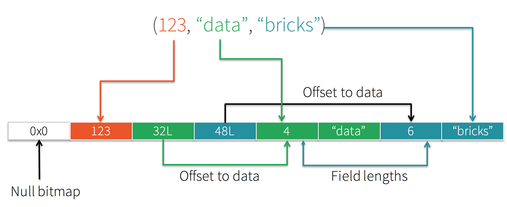
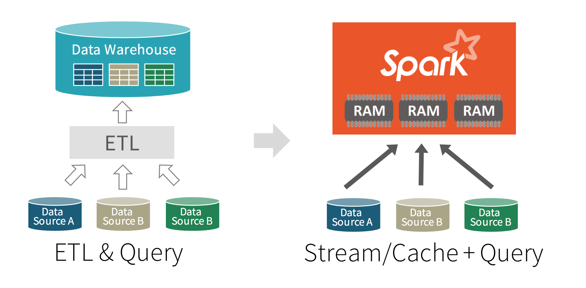

## What's Next?


Note: 
- Contribution of Spark is two fold
- Unifying Data sources 
- Unifying Data Processing 

--

### Optimized Execution with Project Tungsten


--


Note:
- Tungsten backend
- Rich Language Binding ⇒ Spak ⇒ Python, Java, R, Scala 
- Take the Result of a Sql query and initiate Map reduce, and vice versa. 


--
### Tungsten's Compact Encoding 




Note: 
- "abcd" ← JVM 48 Bytes 
- in tungsten ← 5  to 6 bytes

--

## Dataset

-- 


- **Typesafe**: operate on domain with compiled lambda function 
- **Fast**: Code-generate encoders for fast serializations
- **Interoperable**: Easily convert DataFrame ←→ Dataset without boiler plate


--

```scala 
val df = ctx.read.json("people.json")

case class Person(name: String, age: Int) 

// Convert data to domain objects.
val ds: Dataset[Person] = df.as[Person] 
ds.filter(_.age > 30)

// Compute histogram of age by name.
val hist = ds.groupBy(_.name).mapGroups { 
  case (name, people: Iter[Person]) ⇒
  val buckets = new Array[Int](10) 
  people.map(_.age).foreach { a ⇒
    buckets(a / 10) += 1 (name, buckets)
  }  
  (name, buckets)
 }

```


--

### More Stuff ...

- DataFrame integration with Streaming and GraphX 
- Tangsten improvements: inmemory cache, better code generation.
- More data sources for stereaming. 

--


### Unified Data Sources 




Note: 
- Build spark based JIT data warehouse to perform real-time analytics
- Data sources can be → traditional warehouse, Kafka, Cassandra, S3
- Recently released REDSHIFT 


--
