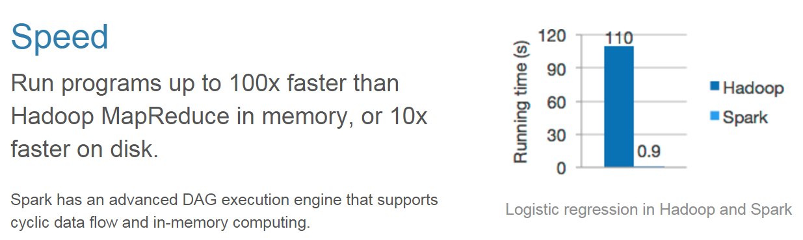
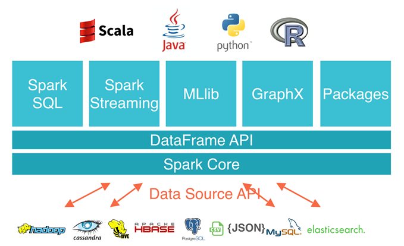

### Introduction to Spark
<blockquote cite="http://spark.apache.org">
	Apache Spark is a <strong>fast</strong> and <strong>general engine</strong> for <strong>large-scale data processing</strong>.
</blockquote>

--

### Large-scale data processing
<blockquote cite="http://spark.apache.org/faq.html">
	Many organizations run Spark on <strong>clusters of thousands of nodes</strong>. The largest cluster we are know has 8000.
	In terms of data size, Spark has been shown to work well up to petabytes...
</blockquote>

--

### Fast

<blockquote cite="http://spark.apache.org/faq.html" styling="float: left">
	... It has been used to sort 100 TB of data <strong>3X faster than Hadoop MapReduce on 1/10th of the machines</strong>, winning
	the 2014 Daytona GraySort Benchmark, as well as to sort 1 PB.
</blockquote>

--

### General engine

